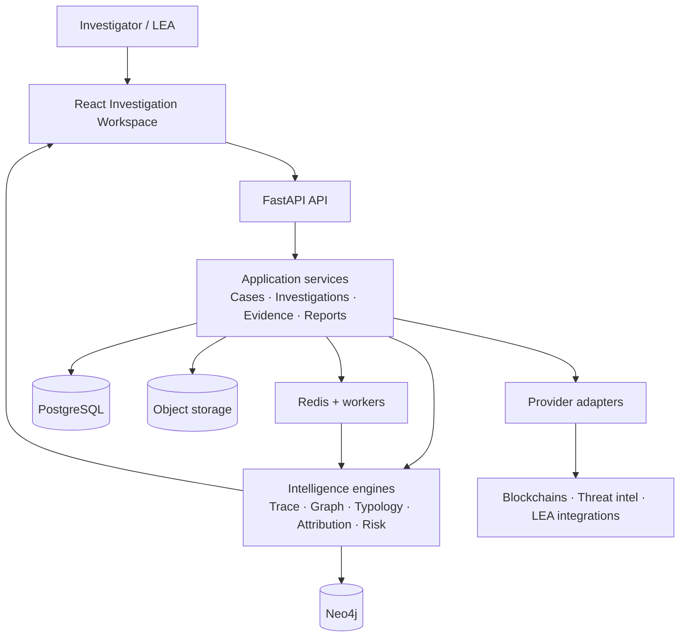

# TraceX Architecture: AS-IS to Target

## Purpose

TraceX is a case-centric investigation platform for SIH 2026 Problem Statement
26183: identify fraud-linked cryptocurrency exchanges from victim-reported
wallets. A wallet is an investigation entry point; a **case** is the primary
business object.

The platform keeps observed blockchain facts separate from analytical inference
and attribution. A transaction hash and block timestamp are facts; “likely
intermediary” and “probable VASP” are findings with confidence and provenance,
not legal identity claims.

## AS-IS

The repository already provides a useful MVP foundation:

- React/Vite investigator UI with a graph workspace.
- FastAPI API, authentication, PostgreSQL-backed users and audit records.
- Multi-chain connectors for Bitcoin, Ethereum, Polygon, and TRON.
- Normalization, graph construction, Neo4j projection, VASP enrichment, and
  explainable baseline risk scoring.
- JSON investigation snapshots and provider diagnostics.

Current runtime flow:

```text
Investigation request → InvestigationService → chain providers
→ normalized transactions → graph / VASP / baseline risk → JSON snapshot + Neo4j
```

This works for an MVP, but `InvestigationService` coordinates too many
responsibilities. It is the main extraction point for future work; it should
not be replaced wholesale.

## Target: modular monolith plus workers

For the SIH scope, TraceX remains one FastAPI deployment with explicit module
boundaries and asynchronous workers. Distributed microservices, Kafka, and a
service mesh are intentionally out of scope.



### Ownership boundaries

| Component | Owns | Does not own |
| --- | --- | --- |
| PostgreSQL | cases, complaints, investigations, audit, findings metadata | graph traversal |
| Neo4j | wallet/entity relationships, paths, clusters, graph projections | operational case state |
| Object storage | raw provider artifacts, exports, reports, hash manifests | queryable business records |
| Redis/workers | queues, transient job state, cache, event fan-out | durable evidence |
| Provider adapters | provider-specific requests and translation | application business logic |

## Investigation lifecycle

```text
Complaint → Case → target wallet → investigation run → evidence acquisition
→ canonical transaction events → graph and intelligence analysis → risk fusion
→ investigator review → alert / evidence package / report
```

The first two implementation increments add the `Case` aggregate and durable
investigation runs while keeping legacy `POST /investigate` working. The
case-scoped endpoint ensures that a run targets a wallet already registered on
that case, records lifecycle state, persists canonical transaction events, and
retains snapshot locations and risk summary after collection completes.

The current typology engine is intentionally deterministic and versioned. Its
initial rules detect fan-out and rapid onward movement, with each finding linked
to the normalized transaction event IDs that support it. Rules are evidence,
not proof of criminal identity; future rules and ML signals follow the same
finding contract.

Risk fusion preserves the original baseline as a named factor and adds only
configured, confidence-weighted typology, threat-intelligence, and provider
attribution contributions. The response stores the score, each point
contribution, explanation, and evidence references, so an investigator can
inspect how a prioritization result was produced. Attribution contributes only
when the provider assessment is confirmed, probable, or possible; unknown and
conflicting provider results do not increase the score.

Threat-intelligence records are case-scoped and retain category, source, URL,
reference, label, and confidence. Fusion uses only the strongest record per
category to avoid inflating risk merely because several sources repeat the same
claim. Intelligence is an evidence input, not an identity assertion.

## Evidence and analytical safety

Every analytical response should converge on this contract:

```json
{
  "data": {}, "confidence": 0.91, "provenance": [], "evidence": [],
  "generated_at": "2026-09-06T00:00:00Z", "version": "1"
}
```

- **Observed fact:** directly supported by a blockchain or provider artifact.
- **Inferred finding:** result of a deterministic rule or graph analysis.
- **Attribution:** confirmed, probable, possible, or unknown, with sources.
- **Model prediction:** calibrated ML signal, never sole proof.
- **Investigator note:** human-authored assessment.

LLM functionality, when added, receives only case-scoped read tools and
verified structured results. It cannot execute database writes, shell commands,
provider calls, or arbitrary URLs.

## Delivery plan

1. ✅ **Operational foundation:** cases, targets, validation, audit events, and case APIs.
2. ✅ **Core investigation:** link runs and snapshots to cases; introduce canonical
   transaction-event persistence.
3. ✅ **Intelligence:** versioned typology rules, threat intelligence,
   evidence-backed attribution, and explainable risk fusion.
4. ✅ **Evidence and reporting:** immutable artifacts (SHA-256 verified), evidence-first
   JSON reports with chain-of-custody audit trails, and export capability.
5. **Realtime and cross-chain:** Redis workers, incremental updates, WebSocket
   events, and confidence-scored bridge links.
6. **ML and AI:** feature pipeline, replaceable inference, and an
   evidence-grounded copilot.

## Non-goals for the MVP

- Full-chain indexing or custom blockchain nodes.
- Kafka, Kubernetes, or service mesh deployment.
- Autonomous enforcement decisions or legal identity claims from ML/AI.
- GNN deployment before a validated feature and labelled-data pipeline exists.

## Operational failure posture

Provider failure must degrade an investigation, not erase it: alternate
provider → cached result → partial result with provenance. If Neo4j is
unavailable, PostgreSQL case data remains usable and graph projection can be
replayed. If ML or an LLM is unavailable, deterministic rules, graph features,
and threat intelligence remain available.
